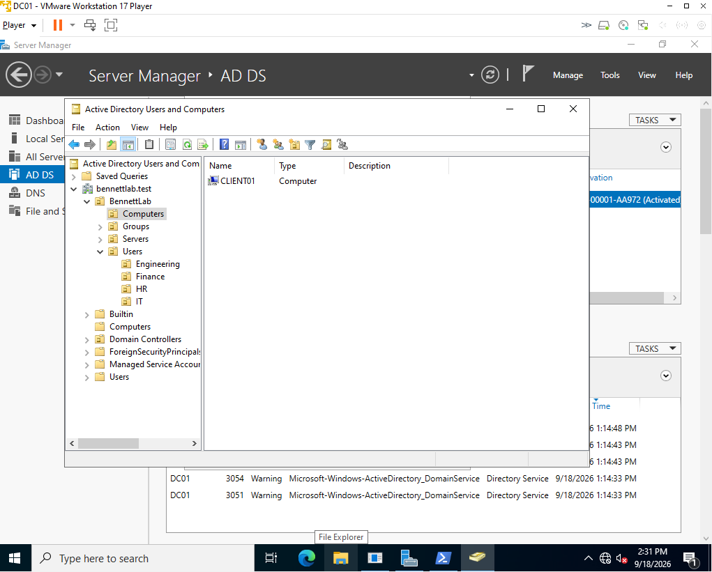
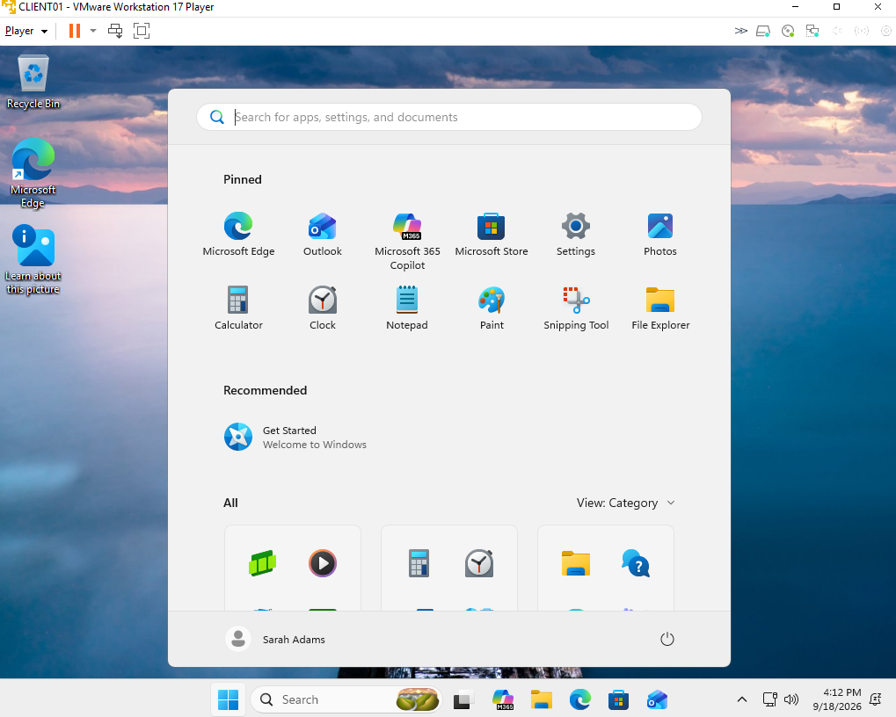
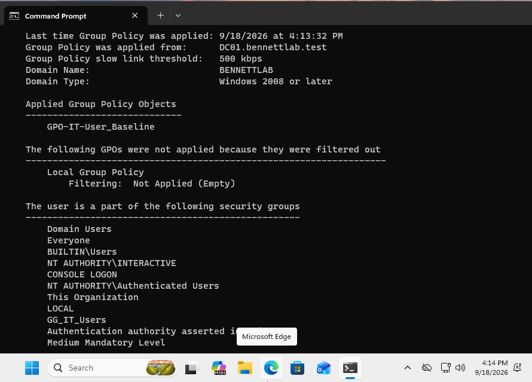
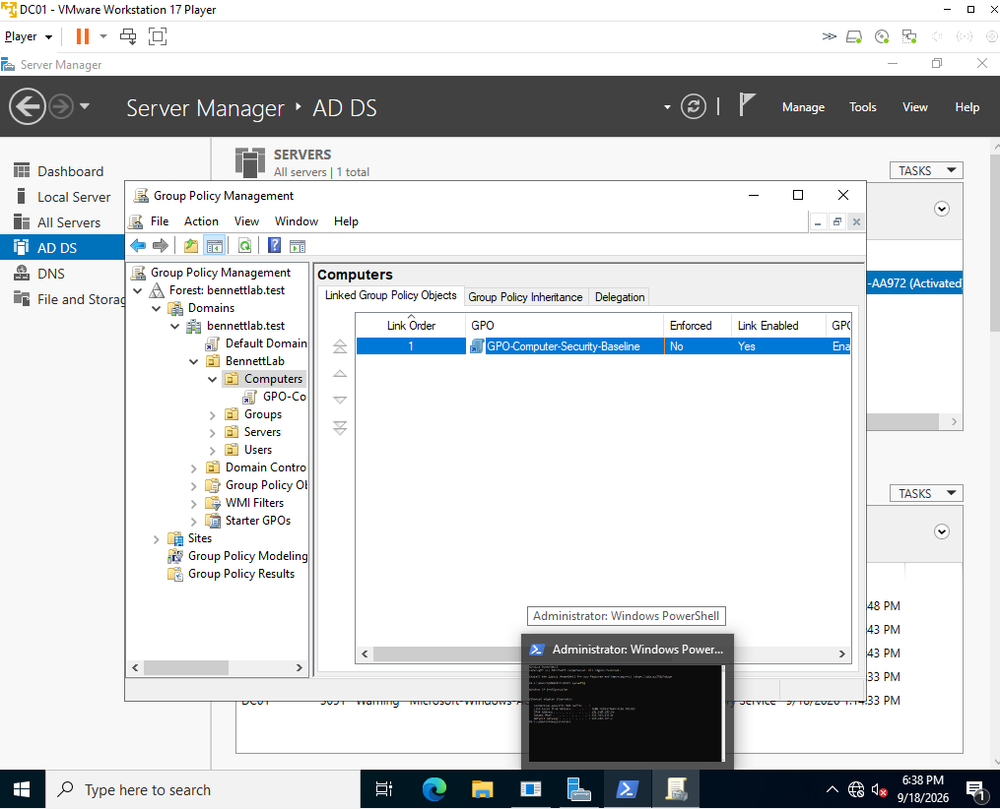
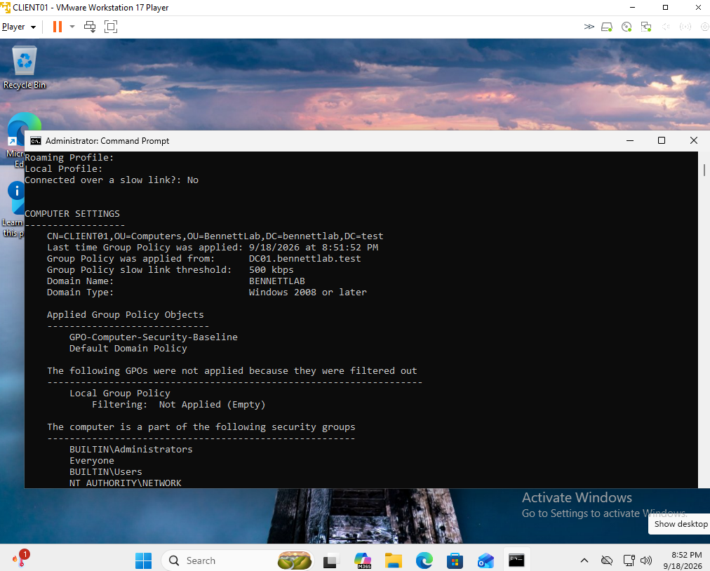

# Lab Documentation

> Full documentation synchronized from [Notion](https://app.notion.com/p/3bbec2a7b0e180229413eb651bba6c5a). Credentials are intentionally excluded.

What did i actually build and how did i build it
VM Name: DC01<br>Hypervisor: VMware Workstation 17<br>Operating System: Windows Server<br>Installation Method: Manual ISO installation<br>Purpose: Future Domain Controller
Virtual Machine Name: DC01<br>Planned Role: Domain Controller<br>Guest OS: Windows Server 2022
DC01 Storage

Virtual Disk Capacity: 60 GB<br>Disk Format: VMDK<br>Storage Method: Split into multiple files

Memory: 4 GB (4096 MB)

Processor Configuration
vCPU: 2 cores<br>Nested Virtualization: Disabled

Installation Media: Windows Server 2022 ISO<br>Virtual Device: CD/DVD (SATA)<br>Connect at Power On: Enabled

Network Configuration
Network Adapter: NAT<br>Connect at Power On: Enabled
Purpose:<br>Used NAT during the initial server installation to provide<br>DC01 with simple network and internet connectivity.

DC01 Initial Configuration
VM Name: DC01<br>Guest OS: Windows Server 2022<br>vCPU: 2<br>Memory: 4 GB<br>Virtual Disk: 60 GB<br>Network Adapter: NAT<br>Installation Media: Windows Server 2022 ISO<br>Current State: VM created, OS not yet installed

Boot Test: Successful<br>Installation Media: Windows Server 2022 ISO<br>Result: Windows Setup launched successfully
Windows Server 2022 installation started successfully.<br>Language: English (United States)<br>Keyboard: US<br>VMware Tools: Not installed yet

Windows Edition:<br>Windows Server 2022 Standard Evaluation (Desktop Experience)
Reason:<br>Selected Desktop Experience to provide the full GUI while learning Windows Server administration.

Installation Type: Custom / Clean Install
Reason:<br>DC01 is a newly created VM with a blank virtual disk, so no existing operating system needs to be upgraded.

Disk Configuration
Disk: Drive 0<br>Capacity: 60 GB<br>Initial State: Unallocated<br>Partitioning Method: Windows Setup automatic partitioning

Windows Server Installation
Edition: Windows Server 2022 Standard Evaluation (Desktop Experience)<br>Installation Type: Custom / Clean Install<br>Target Disk: 60 GB VMDK<br>Partitioning: Automatically configured by Windows Setup<br>Status: Installation in progress

Local Administrator Account: Configured<br>Password: Stored securely / not documented

Operating System Installation: Complete<br>Guest OS: Windows Server 2022 Standard Evaluation (Desktop Experience)<br>Local Administrator Account: Configured<br>Boot from Virtual Disk: Successful

Initial Windows Server Login
Account: Local Administrator<br>Server Manager: Launched successfully<br>Network Type: VMware NAT<br>Network Discovery: Enabled for lab network

File and Storage Services is where you can eventually manage things like disks, volumes, storage, and file shares.
All Servers will show every Windows Server you've added to Server Manager.
Local Server means the Windows Server you're currently logged into. Later i will be able to manage other servers remotely from here too.
.png%22%2C%22permissionRecord%22%3A%7B%22table%22%3A%22block%22%2C%22id%22%3A%223bcec2a7-b0e1-802f-aa8b-e00b362ed8e6%22%2C%22spaceId%22%3A%220aeec2a7-b0e1-812d-b197-000315d938b0%22%7D%7D)
VMware Tools installs drivers and utilities inside the guest OS that improve communication between Windows Server and VMware.
It can improve:
- display resolution
- mouse integration
- virtual hardware drivers
- network performance
- time synchronization
- interaction between the guest and hypervisor

Issue Encountered:<br>VMware Tools installation returned:<br>"Could not find component on update server."
Troubleshooting:<br>Pending network connectivity and DNS testing.
Status:<br>Unresolved

Network Connectivity Test
IPv4 Address: 192.168.197.133<br>Subnet Mask: 255.255.255.0<br>Default Gateway: 192.168.197.2<br>DNS Server: 192.168.197.2
Tests Performed:
- ping 8.8.8.8
- nslookup [google.com](http://google.com/)
Results:
- External IP connectivity successful
- 0% packet loss during ping test
- DNS name resolution successful
Conclusion:<br>DC01 has working network and DNS connectivity.<br>The VMware Tools download failure does not appear to be caused<br>by a connectivity problem inside the guest operating system.

Hostname Configuration
Original Hostname: WIN-UN79G0P60K9<br>New Hostname: DC01<br>Method: PowerShell
Command:<br>Rename-Computer -NewName "DC01" -Restart

Initial Network Configuration
Hostname: DC01<br>IPv4 Address: 192.168.197.133<br>Subnet Mask: 255.255.255.0 (/24)<br>Default Gateway: 192.168.197.2<br>DNS Server: 192.168.197.2<br>DHCP Server: 192.168.197.254<br>DHCP Enabled: Yes<br>MAC Address: 00-0C-29-BF-69-FA
Observation:<br>DC01 is currently receiving its IP configuration dynamically<br>from VMware DHCP.
Next Action:<br>Configure a static IPv4 address before deploying Active Directory.
```plain text

           INTERNET
              |
         VMware NAT
              |
  ┌───────────┴───────────┐
  │                       │
DC01                   CLIENT01
```
Windows Server             Windows 11<br>192.168.10.10             192.168.10.100<br>\|<br>Active Directory<br>DNS<br>DHCP

VMware NAT Network
Network: 192.168.197.0/24<br>Host VMnet8 Address: 192.168.197.1<br>NAT Gateway: 192.168.197.2<br>DHCP Range: 192.168.197.128 - 192.168.197.254
DC01 Planned Static Configuration:<br>IP Address: 192.168.197.10<br>Subnet Mask: 255.255.255.0<br>Prefix Length: /24<br>Default Gateway: 192.168.197.2<br>DNS Server: 192.168.197.2 (temporary)
Reason:<br>192.168.197.10 is outside VMware's DHCP pool, reducing the<br>risk of a DHCP client being assigned the same address.

Active Directory Deployment
Server: DC01<br>Role Selected: Active Directory Domain Services (AD DS)
Purpose:<br>Provide centralized identity, authentication, authorization,<br>and management services for the Windows domain.
Current Status:<br>AD DS role pending installation.<br>DC01 has not yet been promoted to a Domain Controller.

Required AD DS Features:
- Group Policy Management
- Remote Server Administration Tools
- AD DS and AD LDS Tools
- Active Directory PowerShell Module
- Active Directory Administrative Center
- AD DS Snap-Ins and Command-Line Tools
- Management Tools Included: Yes
AD DS Prerequisites Reviewed
- Static IPv4 configuration already completed
- DNS is required for Active Directory
- DNS Server role will be installed during domain controller configuration
- Lab currently uses one domain controller: DC01
- Additional domain controllers may be added later for redundancy

AD DS Role Installation
Server: DC01<br>Role: Active Directory Domain Services<br>Installation Result: Successful
Supporting Components:
- Group Policy Management
- Active Directory PowerShell Module
- Active Directory Administrative Center
- AD DS Snap-Ins and Command-Line Tools
Current State:<br>AD DS is installed, but DC01 has not yet been promoted<br>to a Domain Controller.
<br>A **Domain Controller** is the server running AD DS that provides services for that domain.<br>

Active Directory Forest Configuration
Deployment Type: New Forest<br>Root Domain Name: bennettlab.test<br>First Domain Controller: DC01
Purpose:<br>Create a new standalone Active Directory forest and root domain<br>for the SysAdmin home lab.

Domain Controller Configuration
Forest Functional Level: Windows Server 2016<br>Domain Functional Level: Windows Server 2016
Domain Controller Capabilities:<br>DNS Server: Enabled<br>Global Catalog: Enabled<br>RODC: Disabled
DSRM Password: [REDACTED]

DNS Configuration
DNS Server Role: Enabled
DNS Delegation:<br>Not configured
Reason:<br>bennettlab.test is being created as a new standalone forest root<br>domain and there is no existing authoritative parent DNS zone<br>requiring delegation.
Warning observed:<br>"A delegation for this DNS server cannot be created because the<br>authoritative parent zone cannot be found."
Impact:<br>Expected for this lab configuration.

Domain Naming Configuration
DNS Domain Name: bennettlab.test<br>NetBIOS Domain Name: BENNETTLAB
Purpose:<br>BENNETTLAB provides the short Windows-compatible domain name,<br>while bennettlab.test is the DNS name of the Active Directory domain.

Active Directory Storage Paths
AD DS Database: C:\\Windows\\NTDS<br>AD DS Logs: C:\\Windows\\NTDS<br>SYSVOL: C:\\Windows\\SYSVOL
Configuration:<br>Default storage locations retained for the lab environment.

Domain Controller Promotion — Review
Forest Root Domain: bennettlab.test<br>NetBIOS Domain Name: BENNETTLAB<br>Domain Controller: DC01
DNS Server: Enabled<br>Global Catalog: Enabled<br>Read-Only DC: Disabled<br>DNS Delegation: Not configured
AD DS Database: C:\\Windows\\NTDS<br>AD DS Logs: C:\\Windows\\NTDS<br>SYSVOL: C:\\Windows\\SYSVOL
Status:<br>Configuration reviewed prior to prerequisite validation.

AD DS Prerequisite Check
Result: Passed successfully
Warnings:
- Legacy Windows NT 4.0-compatible cryptography warning
- DNS delegation could not be created
- Server will reboot automatically after promotion
Assessment:<br>Warnings are expected for this standalone lab environment<br>and do not prevent Domain Controller promotion.

Domain Controller Promotion Verification
Command:<br>whoami
Result:<br>BENNETTLAB\\Administrator
Conclusion:<br>DC01 was successfully promoted and the Administrator session<br>is now authenticated against the BENNETTLAB domain.

Active Directory Domain Verification
Command:<br>Get-ADDomain
Results:<br>DNS Root: bennettlab.test<br>NetBIOS Name: BENNETTLAB<br>Domain Mode: Windows2016Domain<br>Distinguished Name: DC=bennettlab,DC=test
Domain FSMO Role Holders:<br>PDC Emulator: DC01.bennettlab.test<br>RID Master: DC01.bennettlab.test<br>Infrastructure Master: DC01.bennettlab.test
Status:<br>Domain configuration verified successfully.

Active Directory Forest Verification
Command:<br>Get-ADForest
Results:<br>Forest Name: bennettlab.test<br>Root Domain: bennettlab.test<br>Forest Mode: Windows2016Forest<br>Domains: bennettlab.test<br>Global Catalog: DC01.bennettlab.test
Forest FSMO Role Holders:<br>Schema Master: DC01.bennettlab.test<br>Domain Naming Master: DC01.bennettlab.test
Status:<br>Forest configuration verified successfully.
Conclusion:<br>DC01 is currently the only Domain Controller and holds all<br>five FSMO roles.

### Lab Documentation
**Created the BennettLab Organizational Unit**
- Domain: bennettlab.test
- OU name: BennettLab
- Location: Root of the domain
- Accidental deletion protection: Enabled
- Tool used: Active Directory Users and Computers
**Purpose:**
The BennettLab OU will serve as the main container for the lab’s users, computers, groups, servers, and departmental OUs.

**Created the Base Active Directory OU Structure**
Created four child OUs inside the BennettLab organizational unit:
- Users — stores domain user accounts
- Computers — stores domain-joined workstations
- Groups — stores security and distribution groups
- Servers — stores member servers added to the domain
Accidental deletion protection was enabled for each OU.
**Result:**
The base OU structure was created successfully and will support centralized administration and targeted Group Policy deployment.

### Active Directory User Accounts
Created three domain user accounts inside the BennettLab/Users/IT OU:
- Jeremy Alice
- Brandon Ba… *(use the complete surname in your notes)*
- Sarah Adams
**Purpose:**
These accounts represent employees in the IT department and will be used to test authentication, security-group membership, delegated permissions, and user-based Group Policies.
**Result:**
All three accounts were created successfully inside the IT OU.

**Created the IT Users Security Group**
- Group name: GG_IT_Users
- Group location: BennettLab/Groups
- Group scope: Global
- Group type: Security
**Members:**
- Brandon Banks
- Jeremy Alice
- Sarah Adams
**Purpose:**
The group centrally manages IT department users and will later be used for permissions, shared resources, and access control.

### What is Group Policy Management?
This console lets a system administrator centrally configure Windows settings for domain users and computers.
Examples include:
- Blocking USB storage
- Enforcing password and lockout rules
- Mapping network drives
- Deploying desktop shortcuts
- Configuring Windows Firewall
- Setting lock screens
- Applying security settings
A **Group Policy Object (GPO)** contains the settings. We then **link** that GPO to a domain or OU to determine which users or computers receive it.

### CLIENT01 DNS and Connectivity Verification
Configured the following network settings on CLIENT01:
- IP assignment: DHCP
- Preferred DNS server: 192.168.197.10
- Alternate DNS server: Blank
- Validate settings upon exit: Enabled
Commands executed:
ipconfig /flushdns<br>ping 192.168.197.10<br>nslookup dc01.bennettlab.test
Results:
- DNS Resolver Cache successfully flushed.
- DC01 responded to all four ping requests.
- Packet loss: 0%
- dc01.bennettlab.test resolved to 192.168.197.10.
- nslookup displayed Server: Unknown, likely because a reverse-DNS/PTR record has not been created.
- Forward DNS resolution is operational.
- CLIENT01 is ready to join the bennettlab.test domain.

### CLIENT01 Domain Join and GPO Validation
Successfully joined the Windows 11 client to the Active Directory domain.
<table header-row="true">
<tr>
<td>Setting</td>
<td>Value</td>
</tr>
<tr>
<td>Client name</td>
<td>CLIENT01</td>
</tr>
<tr>
<td>Client IP</td>
<td>192.168.197.134</td>
</tr>
<tr>
<td>Domain</td>
<td>bennettlab.test</td>
</tr>
<tr>
<td>Domain controller</td>
<td>DC01</td>
</tr>
<tr>
<td>Domain controller IP</td>
<td>192.168.197.10</td>
</tr>
<tr>
<td>Client DNS server</td>
<td>192.168.197.10</td>
</tr>
<tr>
<td>Test user</td>
<td>Sarah Adams</td>
</tr>
<tr>
<td>Domain username</td>
<td>BENNETTLAB\\sadams</td>
</tr>
</table>
Domain-join procedure:
1. Opened System Properties using sysdm.cpl.
2. Selected **Computer Name → Change**.
3. Selected **Domain** and entered bennettlab.test.
4. Authenticated using domain-administrator credentials.
5. Received the message: **Welcome to the bennettlab.test domain**.
6. Restarted CLIENT01.
7. Selected **Other user** and signed in with Sarah Adams’s domain account.
Validation commands:
whoami<br>gpupdate /force<br>gpresult /r
Validation results:
- Domain authentication succeeded.
- Group Policy was received from DC01.bennettlab.test.
- GPO-IT-User_Baseline appeared under **Applied Group Policy Objects**.
- Sarah’s GG_IT_Users membership appeared in the security-group results.
- Local Group Policy was filtered as empty, which is expected.
- The IT user baseline was successfully deployed and validated on CLIENT01.

### Organizing the CLIENT01 Computer Account
After CLIENT01 joined the domain, Active Directory automatically created its computer account in the default Computers container.
The computer account was moved using Active Directory Users and Computers:
Source: bennettlab.test\\Computers<br>Destination: bennettlab.test\\BennettLab\\Computers<br>Computer object: CLIENT01
The move was verified by opening the custom BennettLab\\Computers OU and confirming that CLIENT01 appeared inside it.
This prepares CLIENT01 for future computer-configuration GPOs linked to the custom Computers OU.

### GPO Information
- **Domain:** `bennettlab.test`
- **Domain controller:** `DC01`
- **Client:** `CLIENT01`
- **GPO:** `GPO-Computer-Security-Baseline`
- **Linked OU:** `BennettLab\Computers`
Computer Configuration<br>└── Policies<br>└── Windows Settings<br>└── Security Settings<br>└── Windows Defender Firewall with Advanced Security
### Configured Firewall Baseline
The following settings were configured for the Domain, Private, and Public profiles:
- Firewall state: **On**
- Inbound connections: **Block (default)**
- Outbound connections: **Allow (default)**
Intended logging configuration:
- Log dropped packets: **Yes**
- Log successful connections: **No**
- Maximum log size: **16,384 KB**
- Log location: Default `pfirewall.log` path
### Verification
`gpresult /scope computer /r` confirmed:
- `CLIENT01` is located in:
CN=CLIENT01,OU=Computers,OU=BennettLab,DC=bennettlab,DC=test
Applied computer GPOs included:
GPO-Computer-Security-Baseline<br>Default Domain Policy
The firewall verification command showed:
State: ON<br>Firewall Policy: BlockInbound,AllowOutbound
---
## Computer Security Baseline Validation
Created and linked **GPO-Computer-Security-Baseline** to `BennettLab\Computers`.
Configured the Domain, Private, and Public firewall profiles with:
- Firewall state: **On**
- Inbound connections: **Block (default)**
- Outbound connections: **Allow (default)**
Validation performed on CLIENT01:
```powershell
gpupdate /force
gpresult /scope computer /r
netsh advfirewall show allprofiles
```
Results confirmed:
- CLIENT01 is located in `OU=Computers,OU=BennettLab,DC=bennettlab,DC=test`.
- `GPO-Computer-Security-Baseline` applied successfully.
- `Default Domain Policy` also applied.
- All three firewall profiles are enabled.
- The effective firewall policy is `BlockInbound,AllowOutbound`.
### Firewall Logging — Open Troubleshooting Item
The intended logging settings are:
- Log dropped packets: **Yes**
- Log successful connections: **No**
- Maximum log size: **16,384 KB**
- Log file: Default `pfirewall.log` location
The effective CLIENT01 configuration currently remains:
```plain text
LogAllowedConnections     Disable
LogDroppedConnections     Disable
MaxFileSize               4096
```
This confirms that the primary firewall baseline is applying, but the customized logging values have not yet become effective.
**Next troubleshooting steps:**
1. Reopen each firewall profile on DC01 and confirm the logging values remained saved.
2. Run `gpupdate /force` on CLIENT01.
3. Check the effective configuration again with `netsh advfirewall show allprofiles`.
4. If needed, inspect Resultant Set of Policy and the Group Policy event logs.
## Verification Screenshots
### Active Directory OU Structure and CLIENT01

### IT User GPO Verification

### Computer Security Baseline Linked to the Computers OU

### Computer GPO Verification on CLIENT01

## GitHub Portfolio
The complete portfolio version of this project is published here:
[Windows Server Active Directory Home Lab](https://github.com/Safwaan97/windows-server-active-directory-lab)
The GitHub repository includes the project overview, architecture, learning notes, lab documentation, troubleshooting log, verification commands, and selected screenshots.
## Current Stopping Point
The Active Directory domain, DNS configuration, custom OU structure, security group, Windows 11 domain join, IT user baseline, and primary computer firewall baseline are operational. The next session will continue troubleshooting the firewall logging values before adding the next computer-security setting.

---

## Permanent Verification Screenshots

### Active Directory OU Structure



### Domain User Session on CLIENT01



### IT User GPO Verification



### Computer Security Baseline GPO Link



### Computer GPO Verification


